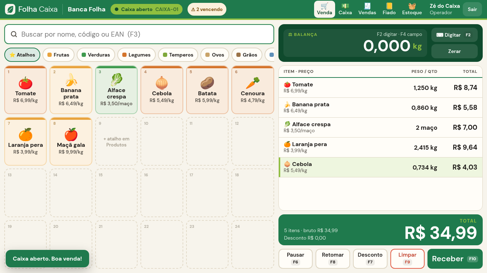

# 🍃 Folha Caixa — *O caixa da banca.*

PDV (frente de caixa) para hortifruti: sacolão, banca de feira, quitanda, mercearia de perecíveis.
Vende **por quilo** com a balança, tem **atalhos de banca** com ícone e cor, aceita **pagamento misto**, controla **fiado com limite**, **perdas** e **fechamento de caixa**.

**Dois jeitos de usar — a mesma tela:**

| | 🌐 **Online** (celular + PC) | 🖥️ **Local** (computador do balcão) |
|---|---|---|
| Endereço | **https://rafaelytofc7-spec.github.io/folha-caixa/** | http://localhost:5170 |
| Dados | banco online (Supabase/Postgres), **os mesmos em todos os aparelhos** | SQLite no próprio computador |
| Internet | precisa (sem internet: abre, mostra o aviso e guarda vendas simples numa fila) | não precisa |
| Instalar | “Instalar app” / “Adicionar à tela inicial” (PWA) | `npm install && npm run build && npm start` |
| Impressora térmica de rede (9100) | não (navegador não deixa) — imprime pelo diálogo, PDF ou .bin | sim |



---

## 0. Modo online (GitHub Pages + Supabase)

**Abrir:** https://rafaelytofc7-spec.github.io/folha-caixa/ — no celular (Chrome/Safari) ou no PC.

1. **Conta da loja (uma vez por aparelho):** e-mail + senha da conta da loja. E-mail e senha **não estão no repositório**: a senha foi gerada e guardada só no computador de administração, em `.store_login` (arquivo fora do Git, permissão 600). Não existe cadastro público — ninguém de fora cria conta.
2. **Depois, cada pessoa entra com o PIN** de 4 dígitos, como no modo local (Admin 1234, Dona Cida 2580, Zé do Caixa 1111).
3. **Instalar como app:** Chrome no Android/PC → menu → *Instalar app* / *Adicionar à tela inicial*; iPhone (Safari) → Compartilhar → *Adicionar à Tela de Início*. Abre em tela cheia com o ícone da folha.
4. **Trocar a senha da conta da loja:** *Config. › Conta da loja › Trocar senha* (pede a senha atual). Ali também tem *Desconectar aparelho*.
5. **Backup:** *Config. › Backup* baixa **todas as tabelas em JSON** (um arquivo) ou **CSV por tabela** (abre no Excel). Os PINs não saem no backup.

**Celular (390 px):** a venda vira duas abas — **Produtos** (atalhos/busca, com a barra verde “🧺 N itens · total · Sacola ›” embaixo) e **Sacola** (itens, total, *Receber*). Tocar num produto por quilo abre o teclado de peso. Janelas abrem de baixo para cima.

**Sem internet (honesto):** o app (a “casca”) abre sem internet pelo service worker e aparece a faixa vermelha **“Sem internet”**. Dá para **finalizar vendas em dinheiro/PIX/cartão/voucher**: elas ficam numa **fila no aparelho** e sobem sozinhas quando a conexão volta (cada venda tem um `client_uuid`, reenviar nunca duplica). **Não funciona offline:** fiado (precisa conferir limite no banco), desconto que exige gerente, cancelamento, estoque, abrir/fechar caixa (o fechamento é bloqueado enquanto houver venda na fila). Venda da fila não é barrada por estoque (ela já aconteceu) e fica marcada `offline` na auditoria. O estoque mostrado offline é o da última vez que carregou.

**Impressão no modo online:** *Imprimir (80 mm)* (diálogo do navegador com a térmica instalada no aparelho), **PDF** (gerado no navegador, jsPDF) e **.bin ESC/POS** (gerado no navegador, para mandar à térmica por outro programa). Mandar direto para a impressora de rede (porta 9100) não é possível a partir de um navegador; esse botão some no modo online.

### Como o modo online é montado

- **Frontend:** o mesmo React de `web/`, compilado com `npm run build:pages` (`vite build --mode supabase`, base `/folha-caixa/`) e publicado pelo GitHub Actions (`.github/workflows/pages.yml`) a cada push na `main`. A camada `web/src/backend/supabase.ts` traduz as rotas `/api/...` para chamadas do Supabase — as telas são as mesmas dos dois modos.
- **Banco:** Postgres do Supabase (`supabase/sql/`): mesmas tabelas (centavos e gramas em inteiros), e **toda operação que mexe em dinheiro ou estoque é uma função `SECURITY DEFINER` atômica** — finalizar venda (baixa estoque + pagamentos + caixa + fiado), cancelar, abrir/fechar caixa, sangria/suprimento, entrada/ajuste/perda, lançar/receber fiado. Número de venda sequencial, auditoria, regra de estoque negativo, bloqueio de inativo, limite de fiado, um caixa aberto por terminal e **PIN do gerente conferido no servidor** (PIN guardado com `crypt()`/bcrypt do pgcrypto).
- **Segurança:** RLS ligado em **todas** as tabelas; só a conta da loja (tabela `store_accounts`) lê; ninguém escreve direto nas tabelas (só pelas RPCs, que exigem o token do PIN do operador). Hash dos PINs e tokens não são legíveis pela API. Cadastro público desligado. A chave que vai no site é a **publishable/anon** (pública por natureza); a `service_role` nunca vai para o site nem para o repositório.
- A **chave pública** e a URL do projeto ficam em `web/.env.supabase`.

### Administrar o banco online (no computador do dono)

Precisa do token da Management API do Supabase em `SUPABASE_ACCESS_TOKEN` (nunca commitar):

```bash
npm run db:apply                      # aplica supabase/sql/*.sql (tabelas, funções, permissões)
npm run db:reset                      # APAGA tudo e recria a loja de exemplo (reset_seed)
node supabase/setup-auth.mjs EMAIL    # desliga cadastro público, cria/reseta a conta da loja e grava a senha em .store_login
npm run test:supabase                 # testes do fluxo contra o banco online (zera para a semente antes e depois)
npm run qa:online                     # QA com Chrome headless na URL publicada (prints em docs/prints/online) e zera no fim
```

---

## 1. Modo local: instalar e ligar

Precisa de **Node.js 20 ou mais novo** (com npm). Não precisa de internet depois de instalar.

```bash
npm install        # instala as dependências (só na primeira vez)
npm run build      # confere os tipos e gera a tela e o servidor
npm test           # roda os testes do fluxo do dia (opcional)
npm start          # liga o caixa
```

Abra **http://localhost:5170** no navegador do balcão (Chrome/Edge). No tablet, use o IP do computador na mesma rede só se você mudar `HOST=0.0.0.0` (veja abaixo) — por padrão o servidor só atende o próprio computador.

Na primeira vez o banco é criado sozinho em `server/data/folha.db` com a loja de exemplo.

| Variável | Padrão | Para quê |
|---|---|---|
| `PORT` | `5170` | porta do caixa |
| `HOST` | `127.0.0.1` | `0.0.0.0` libera para o tablet da rede local |
| `FOLHA_DB` | `server/data/folha.db` | arquivo do banco SQLite |
| `LOG` | — | `LOG=1` mostra o log de requisições |

Outros comandos:

```bash
npm run dev                 # desenvolvimento: API em :5170 + Vite em :5173 (com proxy)
npm run seed -- --reset     # APAGA o banco e recria a loja de exemplo (cuidado!)
npm run prints              # gera as capturas de tela em docs/prints (usa o Chrome instalado)
npm run zip                 # gera ../folha-caixa.zip com o código (sem node_modules)
```

## 2. Usuários e PINs (loja de exemplo “Banca Folha”)

| Usuário | Papel | PIN |
|---|---|---|
| Admin | admin | **1234** |
| Dona Cida | gerente | **2580** |
| Zé do Caixa | operador | **1111** |

- **Operador** vende, abre/fecha caixa, faz sangria/suprimento, recebe fiado.
- **Gerente** (ou admin) autoriza com PIN: **cancelamento de venda**, **desconto acima do limite** (padrão 10%), **perda/quebra**, **ajuste de estoque** e lançamento manual no fiado. Quando o operador tenta, abre a janela “PIN do gerente” e o servidor confere o papel.
- **Admin** cria usuários e troca PINs (Config. › Usuários).

Troque os PINs antes de usar de verdade.

## 3. Teclado, balança e leitor

| Tecla | O que faz |
|---|---|
| **F2** | digitar o peso na mão (teclado numérico grande; 1 2 5 0 = 1,250 kg) |
| **F4** | ir para o campo da balança |
| **F3** | busca por nome / código / EAN |
| **Enter** | confirma peso, código ou busca |
| **F6** | pausar venda · **F8** retomar |
| **F7** | desconto no total (% ou R$) |
| **F9** | limpar a sacola |
| **F10 / F12** | receber (pagamento) — e, dentro do pagamento, finalizar |
| **F1…F6** (no pagamento) | Dinheiro, PIX, Débito, Crédito, Voucher, Fiado |
| **↑ ↓ / Delete** | escolher / tirar item da sacola |
| **Esc** | fecha janela / cancela pesagem |

**Balança e leitor entram como teclado** (modo “keyboard wedge”), com Enter no fim:

- O **peso** pode chegar no campo da balança ou na busca: `1,250`, `01.250` ou `0.500` (com separador = kg). Digitado sem vírgula vale em **gramas** (`1250` = 1,250 kg).
- Fluxo da banca: **põe na balança → toca no atalho** (o peso vai para o item e zera). Ou **toca no atalho primeiro** → aparece “Pese o Tomate e aperte Enter”.
- **Código de barras** (EAN) ou **código interno** na busca + Enter adiciona o item.
- **Etiqueta de balança** (EAN-13 que começa com `2`): `2` + código do produto (5 dígitos) + peso em gramas (6 dígitos) + DV. Ex.: `2 00101 001500 x` = Tomate 1,500 kg. Em Config. dá para trocar para “preço na etiqueta” e 4/5/6 dígitos de código.

## 4. Um dia de banca

1. **Abrir o caixa** — Entre com o PIN, conte o fundo de troco (ex.: R$ 100,00) e toque em *Abrir caixa* (na própria tela de venda ou em *Caixa*). Um caixa aberto por terminal; o nome do terminal fica em Config.
2. **Chegou mercadoria** — *Estoque › Entrada de compra*: produto, quantidade em kg, custo por kg, **lote e validade (opcionais)**. O custo atualiza a margem.
3. **Vender com a balança** — Ponha o tomate na balança, toque em **Tomate**: entra `1,250 kg × R$ 6,99/kg = R$ 8,74` (total da linha = `round(preço/kg × gramas ÷ 1000)`). Alface/maço/bandeja/dúzia/pacote entram por unidade; toque de novo para somar. Toque na linha para mudar peso/quantidade ou dar **desconto no item** (% ou R$).
4. **Receber** — F10. Lance quanto foi em cada forma: **PIX R$ 20,00 + Dinheiro R$ 50,00** → mostra o **troco** (troco só sai do dinheiro; PIX/cartão/voucher/fiado não passam do total). Cliente é opcional; **fiado** exige cliente e respeita o limite.
5. **Cupom** — sai na tela, com *Imprimir (80 mm)*, *PDF*, *.bin ESC/POS* e *Térmica* (impressora de rede). Todo cupom diz **“NÃO É DOCUMENTO FISCAL”**.
6. **Freguês esqueceu a carteira** — F6 *Pausar* (dá um nome, “Moça do boné”), atende o próximo, F8 *Retomar*.
7. **Sangria / suprimento** — *Caixa › Sangria* tira dinheiro da gaveta (não deixa tirar mais do que tem); *Suprimento* põe troco.
8. **Perda / quebra** — *Estoque › Perda*: produto, quantidade, motivo (**amadureceu, estragou, queda, consumo interno**). Precisa do PIN do gerente, baixa o estoque, **não vira venda** e aparece no relatório de perdas pelo custo.
9. **Item vencendo** — o cabeçalho mostra “⚠ N vencendo” (lotes que vencem em até 2 dias) e o atalho ganha a etiqueta “vence”.
10. **Fiado** — *Fiado*: extrato do cliente, **Receber** (dinheiro/PIX/cartão — entra no caixa aberto) e *Lançar no fiado* (dívida antiga do caderno, com PIN do gerente).
11. **Cancelar venda** — *Vendas › Cancelar* (só vendas do dia, PIN do gerente): **o estoque volta, o caixa é estornado** por forma e o fiado também.
12. **Fechar o caixa** — *Caixa › Fechar caixa*: digite o **contado** de cada forma (dinheiro, PIX, débito, crédito, voucher, fiado); a tela mostra **esperado × contado × diferença** (sobra/falta) e imprime o fechamento.
13. **Relatórios** — dia/período: vendido, nº de vendas, **ticket médio**, **margem estimada** (preço − custo), por **operador**, **pagamento**, **categoria**, **produto**, **perdas** — com botão **CSV** em cada bloco (separador `;`, abre no Excel) e impressão.
14. **Backup** — *Config. › Backup › Fazer backup agora* e copie o arquivo para um pendrive.

## 5. Estoque negativo, itens inativos e regras

- Produto **inativo não vende** (nem pela busca, nem pelo leitor).
- **Estoque negativo é bloqueado** por padrão. Para o fim de feira, libere em *Config. › Liberar estoque negativo* ou só no produto (*Pode vender sem estoque*).
- Desconto acima do limite (Config., padrão 10% sobre o bruto da venda) pede PIN do gerente.
- Unidades: **KG** (padrão), **UN**, **BANDEJA**, **MAÇO**, **DÚZIA**, **PCT**.
- **Dinheiro em centavos** (inteiro) no banco. **Peso em gramas** (inteiro), exibido em kg com 3 casas. Para unidades, a quantidade é guardada ×1000 (2 un = 2000), o que deixa uma só fórmula para todos.

## 6. Cupom e impressora

- **HTML 80 mm**: botão *Imprimir* usa `window.print()` com CSS de 80 mm (escolha a térmica no diálogo do navegador). Também em `/api/sales/:id/receipt.html?print=1`.
- **PDF 80 mm**: `/api/sales/:id/receipt.pdf` (gerado no servidor com pdfkit).
- **ESC/POS 80 mm (48 colunas)**: `/api/sales/:id/receipt.bin` — inicializa, página de código PC860 (acentos em português), negrito, total em fonte dupla, abre a gaveta quando teve dinheiro e corta o papel.
- **Impressora de rede**: informe IP/porta (RAW 9100) em Config. e use *Térmica ESC/POS*. Sem impressora configurada ou desligada, aparece um aviso — o caixa não trava.
- O fechamento de caixa tem as mesmas saídas (`/api/cash/sessions/:id/report.{html,pdf,bin}`).

## 7. Backup e restauração

- *Config. › Backup* cria uma cópia consistente do SQLite (API de backup do SQLite, pode ser feita com o caixa aberto) em `server/data/backups/folha-AAAA-MM-DD-HH-MM-SS.db` e deixa baixar.
- **Restaurar**: desligue o caixa (`Ctrl+C`), substitua `server/data/folha.db` pelo arquivo do backup (apague `folha.db-wal` e `folha.db-shm` se existirem) e ligue de novo.

## 8. Fiscal

O cupom é **não fiscal**. Existe a interface `FiscalProvider` (`server/src/services/fiscal.ts`) com um **`MockFiscalProvider`** que só registra uma “emissão simulada” em `fiscal_documents` para cada venda. Nada é enviado à SEFAZ. NCM, CFOP e CST ficam guardados no produto para uma NFC-e futura.

## 9. Por dentro

```
folha-caixa/
├── shared/      tipos, cálculo de venda/desconto/troco, formatação BRL/kg, etiqueta de balança
├── server/      Fastify + TypeScript + better-sqlite3
│   ├── migrations/001_init.sql   migrações SQL (rodam sozinhas ao ligar)
│   ├── src/services/             caixa, vendas, estoque, fiado, relatórios, cupom, fiscal
│   ├── src/app.ts                rotas /api (validação com zod) + serve a tela compilada
│   └── test/flow.test.ts         testes de integração (vitest) em SQLite temporário
├── web/         React + TypeScript + Vite (fonte DM Sans embutida, sem CDN)
│   ├── src/backend/   modo online: supabase.ts (rotas → RPCs), fila offline, datas
│   ├── src/files.ts   PDF (jsPDF), .bin ESC/POS, CSV e backup gerados no navegador
│   └── public/        manifest.webmanifest + ícones do PWA (sw.js é gerado no build)
├── supabase/    modo online: sql/ (esquema, funções, seed, permissões), apply.mjs, setup-auth.mjs, test/
├── scripts/     prints.mjs, qa-online.mjs, icons.mjs, zip.sh
├── .github/workflows/pages.yml   build + deploy no GitHub Pages
└── docs/prints/ capturas de tela (online/ = modo online)
```

- **Transação** em toda baixa de estoque e movimento de caixa (venda, cancelamento, perda, entrada, ajuste, sangria, suprimento, recebimento de fiado, fechamento).
- **Kardex** (`stock_movements`) com saldo após cada movimento; **auditoria** (`audit_log`) de login, vendas, cancelamentos, perdas, descontos autorizados, configurações, usuários e backups — visível em *Config. › Auditoria*.
- **Número de venda sequencial** único; **uma sessão aberta por terminal** garantida por índice único no banco.
- Tela: fundo creme `#F7F4EC`, verde-folha `#1F7A4D` nas ações, lima `#8FBF3F` no destaque, tomate `#E25B45` só para cancelar/perda, carvão `#1C1917` no texto. Números tabulares grandes; botões ≥ 48 px; pensado para 1366×768 e tablet (1024×768, 1180×820).

## 10. Testes

`npm run test:supabase` roda `supabase/test/flow.test.mjs` (11 testes) **contra o banco online de verdade** (RPCs + RLS), zerando para a semente antes e depois: sem login não lê nem chama nada, cadastro público desligado, PIN errado/certo, hash do PIN ilegível, escrita direta bloqueada, abrir caixa (e recusar o segundo), vender **1,250 kg de tomate com PIX + dinheiro** e troco, número sequencial, estoque negativo/inativo/troco/desconto com gerente, fila offline sem duplicar, fiado com limite e recebimento, **perda** com PIN do gerente, **cancelar** (estorna estoque e caixa), sangria/suprimento e **fechar** com diferença, relatório e auditoria.

`npm test` roda `server/test/flow.test.ts` (20 testes) num banco temporário:
abrir caixa (e recusar o segundo), vender **1,250 kg** de tomate com **PIX + dinheiro** e troco, recusar PIX acima do total, cupom texto/ESC-POS/PDF com “NÃO É DOCUMENTO FISCAL”, desconto acima do limite com gerente, **lançar perda**, estoque negativo bloqueado/liberado, item inativo, fiado com limite e recebimento, sangria/suprimento, **cancelar** (estorna estoque e caixa), pausar/retomar, **fechar caixa** (contado × esperado), relatório/CSV, auditoria e backup.

## 11. Capturas (docs/prints)

| | |
|---|---|
| `01-login-pin.png` | entrada com PIN |
| `02-venda-caixa-fechado.png` | venda com caixa fechado (abre ali mesmo) |
| `03-venda-carrinho-balanca.png` | pesando a cebola (pesagem pendente) |
| `04-venda-carrinho.png` | sacola com peso, preço/kg e total |
| `05-pagamento-misto.png` | PIX + dinheiro com troco |
| `06-cupom.png` | cupom 80 mm |
| `07-caixa-aberto.png` / `08-caixa-fechamento.png` / `09-caixa-relatorio-fechamento.png` | caixa e fechamento |
| `10-estoque-perda.png` | perda/quebra |
| `11-relatorio.png` | relatório do dia |
| `12-cadastro-produto.png` / `13-atalhos-config.png` | cadastro e atalhos |
| `14-fiado-extrato.png` / `15-vendas-do-dia.png` | fiado e vendas |
| `16-venda-pausada.png` / `17-cancelamento-pin-gerente.png` / `18-venda-cancelada.png` | pausa e cancelamento |
| `tablet-1024x768-*.png`, `tablet-1180x820-*.png` | tablet no balcão |

**Modo online** (`docs/prints/online/`, tirados na URL publicada; resultado em `RESULTADO.txt`):

| | |
|---|---|
| `desk-01-conta-da-loja.png` / `desk-02-pin.png` | conta da loja e PIN (1366×768) |
| `desk-04-carrinho.png` … `desk-06-cupom.png` | venda 1,250 kg PIX + dinheiro e cupom |
| `desk-07-sem-internet-fila.png` | faixa “Sem internet” e venda na fila |
| `desk-08-abriu-sem-internet.png` | app reaberto sem internet (service worker) |
| `desk-10-config-trocar-senha.png` / `desk-11-backup.png` | trocar senha e backup JSON/CSV |
| `tab-*.png` | 1024×768 |
| `cel-*.png` | celular 390×844: produtos, peso, barra da sacola, sacola, pagamento, cupom, caixa |
| `novo-01-mesmas-vendas-outro-navegador.png` | outro navegador, sem nada salvo, vê as mesmas vendas |

## 12. Limitações (o que ainda não faz)

- **Sem NFC-e/SEFAZ**: só o `MockFiscalProvider`. Cupom não fiscal.
- **Balança serial direta** (protocolo Toledo/Filizola pela porta COM) não está implementada: a balança precisa estar em modo teclado (wedge) ou usar etiqueta EAN-2.
- **TEF/maquininha e PIX dinâmico** não integrados: o operador lança o valor recebido na maquininha.
- **Lotes**: a saída consome o lote que vence primeiro (informativo); o cancelamento devolve ao saldo do produto, mas não ao lote.
- **Vários terminais** funcionam se apontarem para o mesmo servidor (cada um com seu nome em Config.), mas não há sincronização entre servidores diferentes. No **modo online** todos os aparelhos já compartilham o mesmo banco (dê um nome de terminal diferente a cada aparelho que tiver caixa próprio).
- **Online × local não se sincronizam**: são bancos separados (Supabase × SQLite).
- **Modo online offline**: só vendas simples entram na fila (sem fiado, sem desconto acima do limite); o resto precisa de internet. Se o aparelho for limpo (dados do navegador apagados) com vendas na fila, elas se perdem.
- **Modo online sem impressão direta na térmica de rede** (porta 9100) e sem *teste de impressora*; sem **restaurar backup** pela tela (o backup online é só exportação JSON/CSV).
- **PIN de 4 dígitos** no modo online: só funciona depois que o aparelho entrou com a conta da loja (que tem senha forte); tentativas erradas ficam na auditoria, mas não há bloqueio automático por excesso de tentativas.
- Plano gratuito do Supabase pausa o projeto depois de ~1 semana sem uso; é só reativar no painel.
- Retirar item da sacola **antes** de finalizar não pede gerente (nada foi vendido ainda); cancelamento de venda finalizada pede.
- A impressão HTML depende do diálogo do navegador; para imprimir sem diálogo use a impressora de rede ESC/POS ou o modo quiosque do Chrome (`--kiosk-printing`).
- O seed traz 8 atalhos; os outros 16 lugares ficam livres para a banca escolher (*Produtos › Atalhos › Sugerir pelos mais vendidos*).
